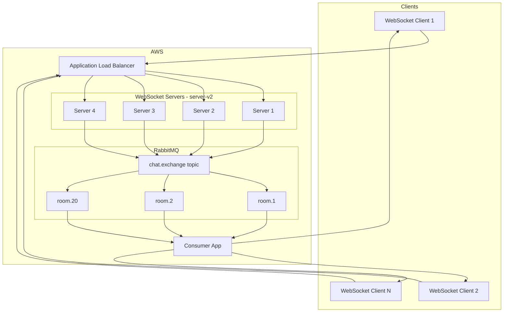
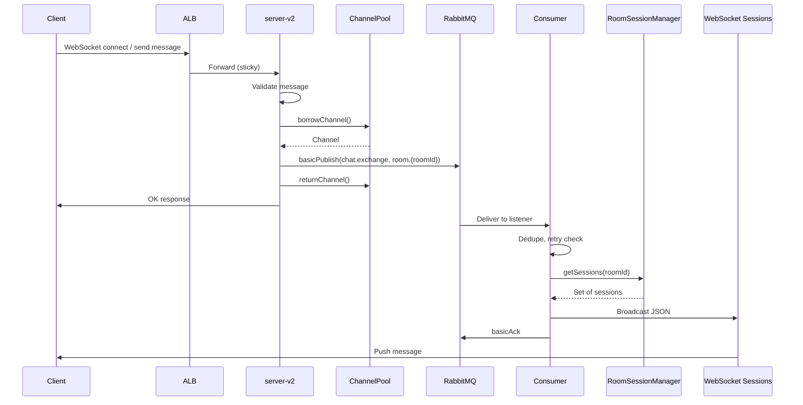

# CS6650 Assignment 2 — Architecture Document

## 1. System Architecture

Clients connect to the ALB (port 80). The ALB forwards WebSocket traffic to server-v2 instances (port 8080) using sticky sessions. Each server publishes messages to RabbitMQ; the consumer application pulls from per-room queues and broadcasts to WebSocket clients connected to it.

---

## 2. Message Flow

---

## 3. Queue Topology

- **Exchange:** `chat.exchange` (topic, durable).
- **Routing:** Routing key `room.{roomId}` (roomId 1–20).
- **Queues:** One queue per room: `room.1` … `room.20` (durable). Each bound to the exchange with routing key equal to queue name.
- **Queue settings:** `x-message-ttl` (e.g. 60s), `x-max-length` (e.g. 1000) to cap depth and avoid unbounded growth.
- **Producer (server-v2):** Channel pool (configurable size); borrow/return for thread-safe publish. Messages published with `PERSISTENT_TEXT_PLAIN`.

---

## 4. Consumer Threading Model

- **Per-room containers:** One `SimpleMessageListenerContainer` per queue (room.1–room.20). Rooms are distributed across these containers.
- **Concurrency:** Each container has configurable `concurrentConsumers` (e.g. 1) and `prefetchCount` (e.g. 10). Total consumer threads = 20 × concurrentConsumers (e.g. 20).
- **Processing:** Same `ChatMessageListener` instance for all containers; manual ack. A shared fixed-size `ExecutorService` (size = `app.consumer.threads`) is used for broadcasting to WebSocket sessions so that slow clients do not block the AMQP consumer threads.
- **State:** `RoomSessionManager` holds `ConcurrentHashMap<String, Set<WebSocketSession>>` for room→sessions and `ConcurrentHashMap<String, UserInfo>` for user state.

---

## 5. Load Balancing Configuration

- **ALB:** Application Load Balancer; HTTP:80 → Target Group (HTTP 8080).
- **Health check:** Path `/health`, interval 30s, timeout 5s, healthy threshold 2, unhealthy threshold 3, matcher 200.
- **Sticky sessions:** Enabled (`lb_cookie`), duration 86400s so a client stays on the same server-v2 instance for the WebSocket lifetime.
- **Idle timeout:** 3600s to support long-lived WebSocket connections.
- **Targets:** server-v2 instances (e.g. 1, 2, or 4) in the same VPC; deregistration delay 300s.

---

## 6. Failure Handling

- **Queue unavailable (server-v2):** Circuit breaker in `QueuePublisher`. After N consecutive publish failures, the circuit opens and publish throws immediately. After a configured duration, state moves to half-open; one success closes the circuit, failure reopens it.
- **Consumer:** Invalid message: ack and skip. Duplicate (by messageId): ack and skip (deduplication cache). Broadcast failure: nack with requeue up to max retries; after max retries, nack without requeue and remove from retry tracking. Empty room: ack without broadcast.
- **At-least-once:** Messages are acked only after successful broadcast; nack+requeue on transient failure. Deduplication and retry limits avoid duplicate delivery and unbounded retries.

---

